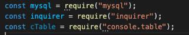
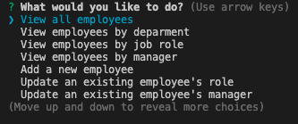

# employeeManagementSystem 

  ## Table of Contents
  1. [Description](#description)
  1. [Installation](#installation)
  1. [Usage](#usage)
  1. [License](#license)
  1. [Contributing](#contributing)
  1. [Tests](#tests)
  1. [Questions](#questions)

  ## Description

  The employeeManagementSystem application is an infterface that makes it easy for non-developer users to interact with information stored in the employee database.  This Content Management System allows Human Resources to easily view, store, update and remove employee data.

  ## Video Demo

  


  ## Installation

  To install this application the user must have node.js installed.  The node depencies that are required are mysql, inquirer and console.table.
  
  


  ## Usage

  To get started with the application, run ```node server.js``` or ```npm start``` in the terminal to be taken to the main menu.  The user will have a list of tasks to choose from.  When the user makes a selection, it display a table ordered by employee id, department, role or manager.  Otherwise, they will be asked a series of prompts to add an employee, remove an employee, or update an employee's role or manager.

    
  

  ## License

  [The Unlicense](http://unlicense.org/)

  This project is licensed under [The Unlicense](http://unlicense.org/).  Please visit the link for more details.


  ## Contributing

  There were no contributors on this project, but collaboration is welcome.  Please feel free to reach out to me regarding changes to the application by creating an issue in Github or contacting me through email.

  ## Tests

  The roles are updated by using a id the is generate and located in the schema.sql file. If an update to the employee data was successful, the console will log the success, else, an error will show in the console.
  
  ## Questions

  **Github:** [dargenioa](http://github.com/dargenioa)

  **Email:** [dargenioa14@gmail.com](dargenioa14@gmail.com)

  For additional questions please feel free to contact me.


